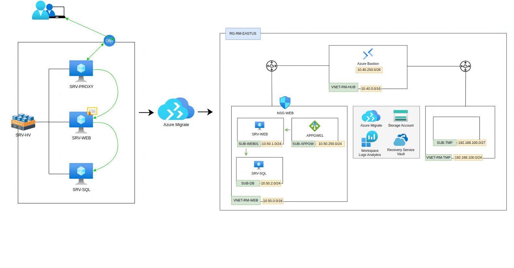

# Azure Migration Project

## Overview
This project aims to migrate two virtual machines (**VM-SQL** and **VM-WEB**) from an on-premises **Hyper-V** environment to **Microsoft Azure**. Additionally, the reverse proxy currently configured on a virtual machine will be replaced with an **Azure Application Gateway**, providing enhanced security, scalability, and performance for traffic management.

---

## Current Environment
### On-Premises Infrastructure
- The current environment is based on VMs managed by **Hyper-V**:
  - **VM-SQL:** Hosts the SQL Server database.
  - **VM-WEB:** Hosts the website using IIS (Internet Information Services).
  - **VM-PROXY:** Acts as the reverse proxy, hosted on an Ubuntu server.
- Communication between components occurs within a local network.

### Challenges of the Current Infrastructure
- Dependence on physical hardware with limited resources.
- Manual maintenance and complex management.
- Lack of scalability and high availability.

---

## Migration Plan
### 1. Project Scope
- Migrate the **VM-SQL** and **VM-WEB** VMs to Azure using **Azure Virtual Machines**.
- Replace the reverse proxy hosted on **VM-PROXY** with an **Azure Application Gateway**, integrated with the Azure environment.

### 2. Project Steps
#### Planning and Analysis
- Assess the configurations and requirements of the VMs (resources, operating system, and applications).
- Identify dependencies between **VM-SQL**, **VM-WEB**, and the proxy.
- Size the required resources in Azure.

#### Azure Environment Setup
- Configure the entire network and security infrastructure
- Configure Azure Bastion to access the migrated VMs.
- Configure the **Azure Application Gateway** to replace the reverse proxy, with routing rules and integrated SSL.

#### Migration and Testing
- Migrate the content from the on-premises VMs to the Azure VMs using tools such as **Azure Migrate**.
- Test connectivity between **VM-WEB**, **VM-SQL**, and the Application Gateway.
- Conduct load and security testing to validate the functionality in Azure.

#### Cutover and Post-Migration
- Redirect traffic to the new Azure environment during the migration window.
- Monitor performance and address potential issues using **Azure Monitor** and **Log Analytics**.

---

## Migration Benefits
1. **Scalability:** Azure VMs can be dynamically scaled to accommodate business growth.
2. **High Availability:** Azure services offer SLAs of 99.95% or higher.
3. **Advanced Security:** **Application Gateway** includes DDoS protection and centralized SSL management.
4. **Simplified Management:** Reduced dependency on physical hardware and improved automation for VM management.
5. **Modernized Infrastructure:** A modern infrastructure ready for future integrations and expansions.

---

## Next Steps
1. Review and create the configurations and dependencies on-premises to migrate.
2. Create a detailed schedule for migration and validation.
3. Begin the implementation of the Azure environment.
4. Create project to migrate
5. Migrate to Azure
6. Disable infrastructure on-premises

## Steps On-premises

* Overview : https://github.com/rafamellonh/AzureMigrate/blob/main/On-premises/On-premises.md

1. [Install-configure-hv](https://github.com/rafamellonh/AzureMigrate/blob/main/On-premises/01%20-%20Install-configure-hv.md)
2. [Install-vm-sql](https://github.com/rafamellonh/AzureMigrate/blob/main/On-premises/02%20-%20install-vm-sql.md)
3. [Install-vm-web](https://github.com/rafamellonh/AzureMigrate/blob/main/On-premises/03%20-%20install-vm-web.md)
4. [Install-vm-proxy](https://github.com/rafamellonh/AzureMigrate/blob/main/On-premises/04%20-%20install-vm-proxy.md)

* After to finish all steps on-premises, go to steps Cloud

5. [Create-infra](https://github.com/rafamellonh/AzureMigrate/blob/main/Cloud/01-Create-infra.md)
6. [Create-Resources](https://github.com/rafamellonh/AzureMigrate/blob/main/Cloud/02-Create-Resources.md)
7. [Azure-Migrate](https://github.com/rafamellonh/AzureMigrate/blob/main/Cloud/03-Azure-Migrate.md)
8. [Azure-Migrate-part-2](https://github.com/rafamellonh/AzureMigrate/blob/main/Cloud/03.01-Azure-Migrate.md)
9. [Azure-Migrate-part-3](https://github.com/rafamellonh/AzureMigrate/blob/main/Cloud/03.02-Azure-Migrate.md)

## Scope

